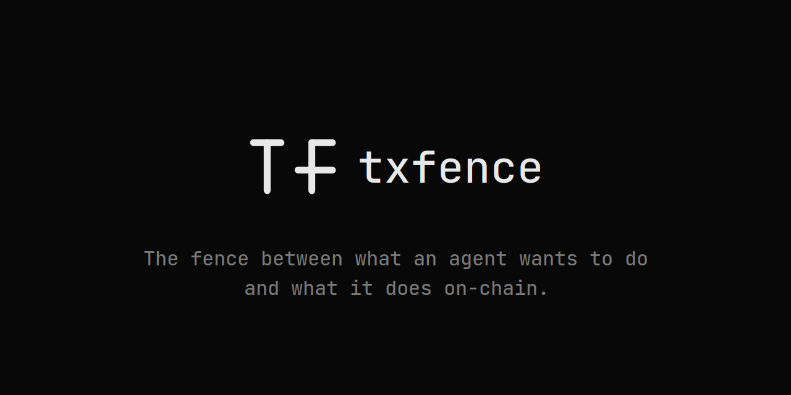

<div align="center">
  
</div>

<br>

<div align="center">

[](https://txfence.vercel.app)
[](https://www.npmjs.com/org/txfence)
[](https://github.com/AdityaChauhanX07/txfence/actions)
[](LICENSE)
[](https://www.typescriptlang.org)

**A typed, composable policy-and-execution SDK for autonomous agents across EVM, Solana, and Cosmos.**

[Getting Started](#quick-start) · [Full Guide](docs/guide.md) · [npm](https://www.npmjs.com/org/txfence) · [Why txfence?](docs/technical-essay.md)

</div>

---

## Why txfence

Autonomous agents transacting on-chain fail in ways that are not obvious. They do not fail because of bugs or hacks. They fail because the conditions at execution time were different from the conditions when their instructions were written. State moved. A contract was upgraded. Two agents read the same cap simultaneously. A human approval timed out and the system defaulted to execute.

These are policy failures, not security failures. txfence is the policy layer.

---

## Quick start

```bash
npm install @txfence/core @txfence/evm
```

```typescript
import { createAgent } from '@txfence/core'
import { simulateEvmAction, executeEvmAction, privateKeySigner } from '@txfence/evm'

const signer = privateKeySigner(process.env.PRIVATE_KEY as `0x${string}`)

const agent = createAgent(
  {
    chains: ['ethereum'],
    policies: {
      chains: ['ethereum'],
      maxSpendPerTx: { token: 'USDC', amount: 1_000n, decimals: 6 },
      allowedContracts: [{ address: '0xYOUR_CONTRACT', chain: 'ethereum' }],
      requireSimulation: true,
      gasBufferMultiplier: 1.2,
      humanApprovalThreshold: { token: 'USDC', amount: 10_000n, decimals: 6 },
      humanApprovalTimeoutMs: 30_000,
      capLockMode: 'per-agent',
    },
    signer,
  },
  { ethereum: { simulate: simulateEvmAction } },
  { ethereum: 'https://ethereum.publicnode.com' },
  (action, chainId, rpcUrl, evaluation, simulation) =>
    executeEvmAction(action, chainId, rpcUrl, signer, evaluation, simulation)
)

const result = await agent.submit({ action, policy: agent.config.policies })
```

---

## What it does

**Policy engine** — declarative per-transaction rules: spend caps, contract allowlists, simulation requirements, gas buffers, human approval thresholds. Composite AND/OR trees for complex authorization logic.

**Simulation before execution** — every transaction is simulated before it signs. Tenderly integration for full execution traces. Fork simulation for multi-step "what if" analysis before committing.

**Intent-level execution** — declare multi-step operations as a dependency graph. Evaluate the sequence holistically before any step executes. Automatic partial failure handling.

**Formal verification** — bounded model checking proves invariants about your policy configuration. Feed in "no agent can spend more than 50K USDC in any 24-hour window across 10 agents" and get a counterexample or a proof.

**Adversarial stress testing** — chaos engineering for crypto policy. Six attack vectors, thousands of scenarios, a risk report with survival rate and actionable recommendations.

**Cryptographic provenance** — every transaction gets a hash-chained provenance record. Merkle proofs let you prove a specific transaction was authorized under a specific policy without revealing others.

**Temporal rules** — stateful behavioral limits over time. "If simulation failures exceed 3 in the last hour, require approval." "If spend velocity exceeds 50K USDC in 30 minutes, reject."

**MEV protection** — route through Flashbots Protect or MEV Blocker to prevent sandwich attacks on swaps.

---

## Packages

| Package | Description |
|---|---|
| [`@txfence/core`](https://npmjs.com/package/@txfence/core) | Policy engine, agent orchestration, cap locking, temporal rules, intent execution |
| [`@txfence/evm`](https://npmjs.com/package/@txfence/evm) | EVM adapter — eth_call + Tenderly simulation, fork simulation, MEV-protected broadcast |
| [`@txfence/solana`](https://npmjs.com/package/@txfence/solana) | Solana adapter |
| [`@txfence/cosmos`](https://npmjs.com/package/@txfence/cosmos) | Cosmos adapter — Cosmos Hub, Osmosis |
| [`@txfence/verify`](https://npmjs.com/package/@txfence/verify) | Formal verification — bounded model checking + adversarial stress testing |
| [`@txfence/provenance`](https://npmjs.com/package/@txfence/provenance) | Cryptographic provenance chains with Merkle proofs |
| [`@txfence/audit`](https://npmjs.com/package/@txfence/audit) | Append-only audit log |
| [`@txfence/monitor`](https://npmjs.com/package/@txfence/monitor) | On-chain reconciliation monitor |
| [`@txfence/mcp`](https://npmjs.com/package/@txfence/mcp) | MCP server — 10 tools for AI assistants |
| [`@txfence/cli`](https://npmjs.com/package/@txfence/cli) | CLI — simulation, verification, replay, intent execution, provenance |
| [`@txfence/redis`](https://npmjs.com/package/@txfence/redis) | Redis cap lock provider for distributed multi-agent deployments |
| [`@txfence/storage-pg`](https://npmjs.com/package/@txfence/storage-pg) | PostgreSQL receipt storage |
| [`@txfence/storage-sqlite`](https://npmjs.com/package/@txfence/storage-sqlite) | SQLite receipt storage |
| [`@txfence/react`](https://npmjs.com/package/@txfence/react) | React hooks for operator UIs |

---

## Documentation

The [full guide](docs/guide.md) covers every feature with examples:
policy engine, composite policies, temporal rules, intent execution,
fork simulation, MEV protection, formal verification, adversarial stress testing,
provenance chains, replay and backtesting, multi-agent coordination,
cap locking, webhook approval, audit log, and monitor.

Read the design rationale: [docs/technical-essay.md](docs/technical-essay.md)
Read the failure taxonomy: [docs/failure-taxonomy.md](docs/failure-taxonomy.md)

---

## Contributing

See [CONTRIBUTING.md](CONTRIBUTING.md). MIT license.

---
